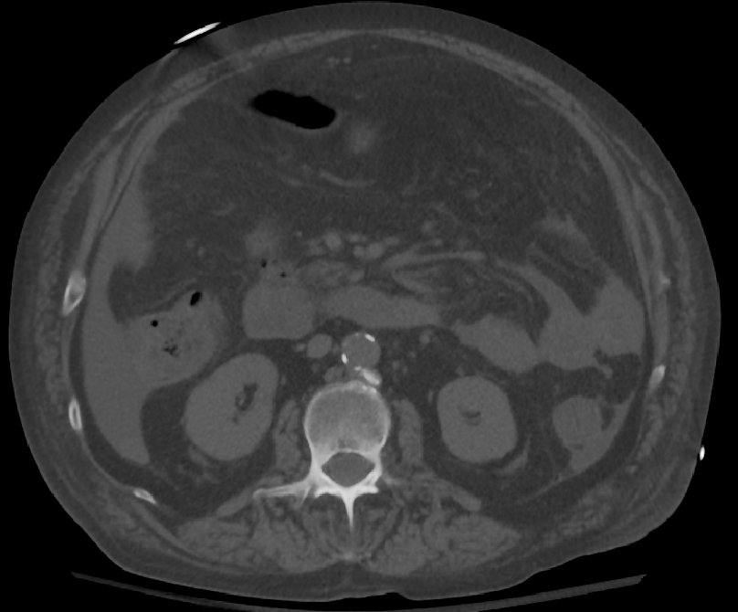
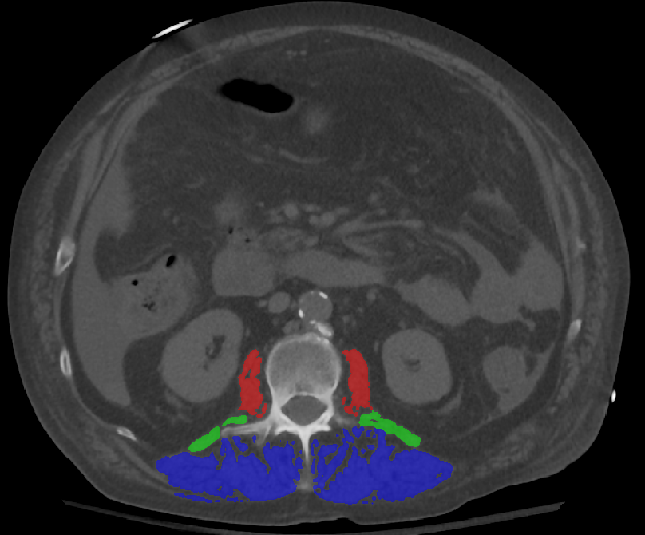
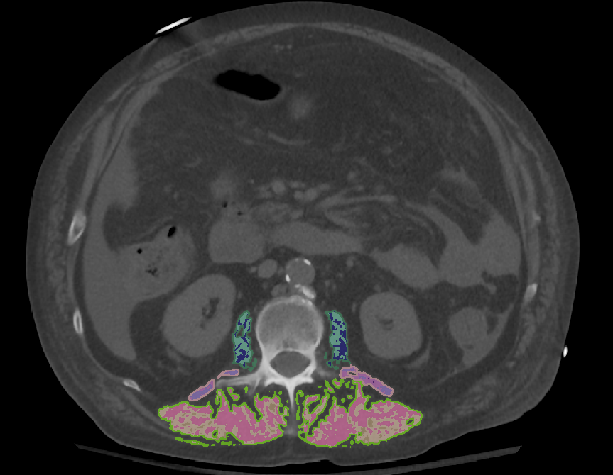

# myoL3

Automated **L3-level trunk-muscle analysis from CT**. You give it a full-body CT;
it resamples to the working resolution, localizes the L3 level and crops to it,
then runs muscle segmentation on the crop.

```
full-body CT (.nii.gz)
      │  resample to target spacing
      ▼
  L3 localizer (presence-gated sliding window)  ──►  z-crop
      ▼
  muscle segmentation (nnU-Net, in-Python)  ──►  raw label map
      ▼
  strip interior fat (IMAT)  ──►  TOTAL muscle segmentation (final)
```

The muscle segmenter loads a self-contained nnU-Net checkpoint and runs
`nnUNetPredictor` via `manual_initialization` (same style as VeinSeg) — no
nnU-Net folder layout or CLI needed. The fat step removes solidly-fat interior
voxels (HU < −30, inside the eroded muscle core) from each muscle.

## Example (L3 axial slice)

| Input CT | Muscle segmentation | Body-composition map |
|---|---|---|
|  |  |  |

- **Muscle segmentation** — psoas (red), quadratus lumborum (green), erector
  spinae / multifidus (blue).
- **Body-composition map** — each muscle is split into compartments: muscle
  (pink), low-attenuation "fat-PV" muscle and intramuscular fat (teal/blue), and
  the partial-volume boundary rim (green outline). The muscle/low-attenuation
  split is a per-scan, per-muscle GMM crossover; interior fat (HU < −30) is
  removed to form the total-muscle segmentation.

## Installation

Not on PyPI yet — clone and install editable:

```bash
git clone <this-repo-url> myoL3
cd myoL3
pip install -e .
```

## Model weights

Both checkpoints live in one Hugging Face repo
([`YousifKhoury/myoL3`](https://huggingface.co/YousifKhoury/myoL3)):
`l3_localizer.pt` (localizer) and `muscle_seg.pth` (self-contained nnU-Net
segmenter). Download them once:

```bash
myol3-install /path/to/models        # downloads both + remembers the paths
```

or point at local files without downloading:

```bash
export MYOL3_LOCALIZER_CKPT=/path/to/l3_localizer.pt
export MYOL3_SEGMENTER_CKPT=/path/to/muscle_seg.pth
```

Resolution order per model: `--*-ckpt` flag → env var → `myol3-install` path
(`~/.myol3/config.json`) → Hugging Face download.

## Usage

```bash
# full pipeline: localize L3 -> crop -> segment -> strip fat -> total muscle seg
myol3 -i fullbody_ct.nii.gz -o total_muscle_seg.nii.gz

# also save the crop, the removed-fat map, and per-muscle fat metrics
myol3 -i fullbody_ct.nii.gz -o total_muscle_seg.nii.gz \
      --save-crop l3_crop.nii.gz --save-fat fat.nii.gz --save-fat-csv fat.csv

# localize + crop only (no segmentation model needed)
myol3 -i fullbody_ct.nii.gz --save-crop l3_crop.nii.gz

# overrides
myol3 -i ct.nii.gz -o seg.nii.gz \
      --localizer-ckpt /path/l3_localizer.pt \
      --segmenter-ckpt /path/muscle_seg.pth \
      --pad 2 --device cuda
```

| Flag | Meaning |
|---|---|
| `-i, --input` | full-body CT (required) |
| `-o, --output` | **total** muscle seg (fat stripped); omit to only localize/crop |
| `--save-crop` | also write the L3-cropped CT |
| `--save-fat` | also write the removed interior-fat label map |
| `--save-fat-csv` | also write per-muscle fat metrics (volume, fraction, mean HU) |
| `--localizer-ckpt` / `--segmenter-ckpt` | checkpoint overrides |
| `--pad` | extra slices each side of the L3 crop |
| `--device` | `cpu` or `cuda` (auto if unset) |

Python API:

```python
import myol3
myol3.run("fullbody_ct.nii.gz", "total_muscle_seg.nii.gz",
          save_crop="l3_crop.nii.gz", save_fat_csv="fat.csv")
```

## Configuration

`myol3/config.py`:
- `TARGET_SPACING` — spacing (mm) to resample the input to; set to what the models were trained at (`None` = keep native).
- `LOCALIZER_HW / LOCALIZER_WIN / LOCALIZER_STRIDE` — localizer input size and sliding-window params.
- `LOCALIZER_MAX_MM` — hard cap on the L3 crop length (mm) so a spurious vote can't stretch it.
- `WL / WW` — CT window for the localizer.
- `FAT_HU / FAT_ERODE` — fat threshold and interior-core erosion for fat stripping.
- `SEG_TILE_STEP / SEG_USE_MIRRORING` — nnU-Net sliding-window step and test-time mirroring.

## Status

- ✅ Resample → L3 localize (presence-gated sliding window, span-capped) → z-crop.
- ✅ Muscle segmentation — in-Python nnU-Net (`manual_initialization`, VeinSeg-style).
- ✅ Fat stripping → total muscle segmentation + per-muscle fat metrics.
